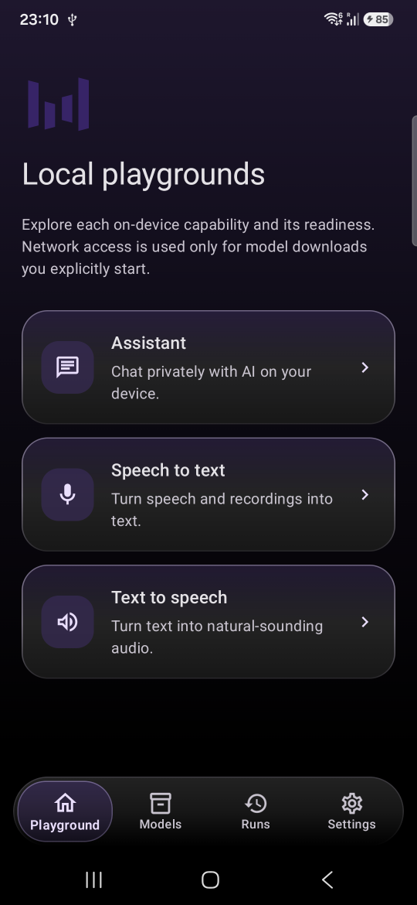
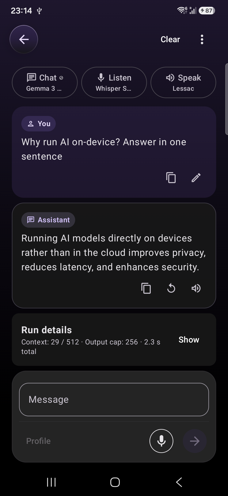
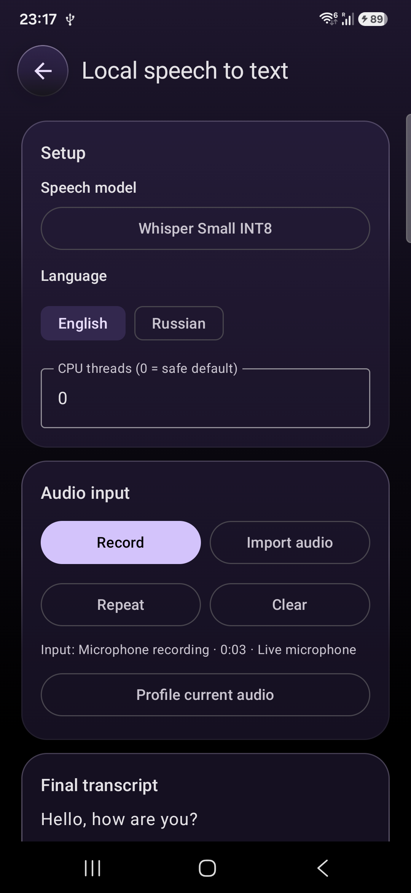
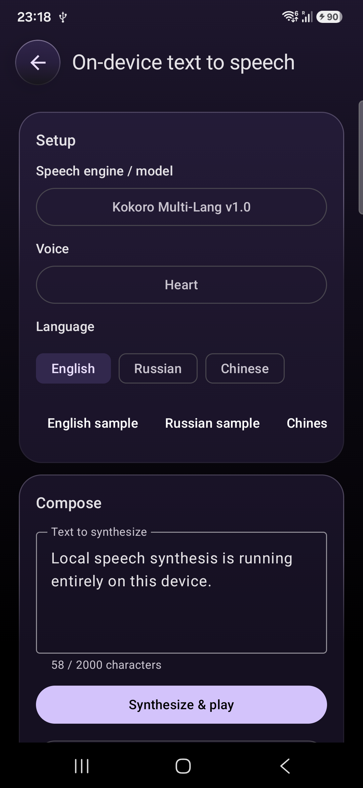
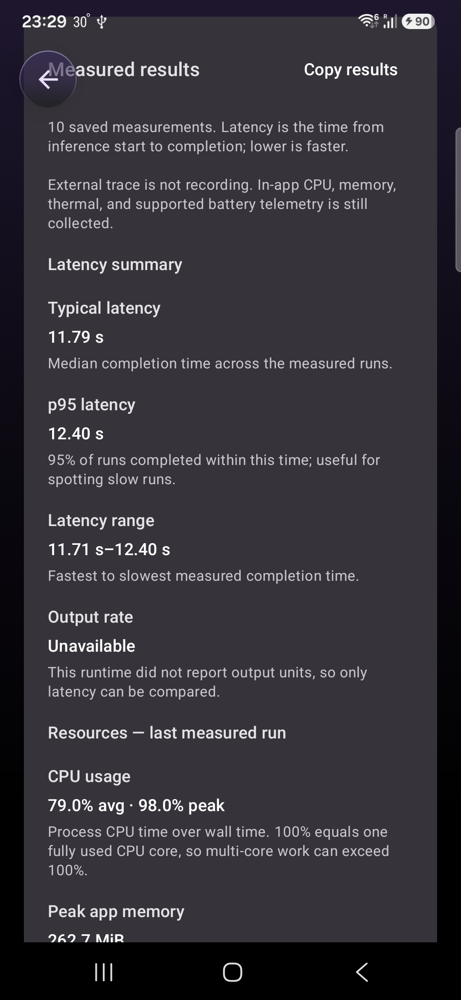

# Local AI Playground

Local AI Playground is a native Android application for running, inspecting, and
comparing language, speech-to-text, and text-to-speech models entirely on-device.

The project explores the engineering behind private local inference: replaceable AI
engines, JNI and native runtime integration, streaming audio, multi-gigabyte model
management, lifecycle-aware cancellation, and reproducible performance measurements.
It is a developer playground rather than an attempt to hide those details behind a
consumer assistant interface.

Developers can install curated models from the in-app catalog, import compatible
model files, or clone this repository and add a model or runtime integration of their own.

<p align="center">
  
</p>

<p align="center">
  
  
  
</p>

<p align="center">
  
</p>

## Technical highlights

- Fully local, privacy-first LLM, STT, and TTS inference — no automatic cloud fallback.
- Replaceable LLM, STT, and TTS engines behind engine-neutral Kotlin contracts.
- Native llama.cpp integration through a narrow C++/JNI boundary with explicit load, cancel,
  unload, and native-memory ownership.
- LiteRT-LM, sherpa-onnx, Vosk, Chatterbox, and Android system speech adapters.
- Transactional, resumable model downloads with file-role validation, checksums, recovery.
- Reproducible benchmark lab that records workload, runtime, device, startup mode,
  thermal state, and performance metrics—not just a single speed number.
- Run history that snapshots model, engine, settings, device, result, and performance
  data so old runs remain meaningful after models are removed.

## What the app can do

- **Local assistant:** stream responses from an installed LLM, tune generation settings,
  use speech input and output, and inspect token and timing metrics.
- **Speech to text:** record or import audio, select a recognition model, control language
  and CPU threads, and inspect real-time factor and processing metrics.
- **Text to speech:** synthesize and play audio, compare voices, adjust runtime and audio-effect
  controls, use reference-audio voice conditioning where supported, and export WAV files.
- **Model library:** browse an app-curated catalog, filter by capability and runtime, download
  models in the background, validate their files, inspect compatibility, and remove installed models.
- **Benchmark lab:** repeat the current chat, STT, or TTS workload with configurable warm-up and
  measured iterations, using warm or cold startup.
- **Run history:** retain inputs, outputs, parameters, model snapshots, and metrics;
  repeat previous workloads and export records as versioned JSON.
- **Device diagnostics:** inspect ABI, memory, storage, CPU, battery, thermal state, and packaged
  runtime availability.

## Runtimes and model families

No model weights are committed to this repository or bundled in the APK.
Models are installed explicitly from the in-app catalog into app-private storage.

| Runtime | Capability | Format or source | Catalog examples |
| --- | --- | --- | --- |
| llama.cpp | Chat | GGUF | Qwen, LFM, Llama, Gemma, DeepSeek, SmolLM, Phi |
| LiteRT-LM | Chat | `.litertlm` | Qwen 3, Gemma 3 |
| sherpa-onnx | STT | ONNX model bundles | Whisper, Parakeet, GigaAM, Zipformer, SenseVoice, Paraformer, Moonshine |
| Vosk | STT | Vosk model directories | Vosk English and Russian |
| sherpa-onnx | TTS | ONNX model bundles | Pocket TTS, Kokoro, Supertonic, Piper/VITS |
| Chatterbox ONNX | TTS | ONNX model bundle | Chatterbox Turbo Q4 with reference audio |
| Android system services | STT and TTS | Installed on-device services | Device-provided recognizer and voices |

## Evaluation and profiling

Local AI performance cannot be reduced to model size or a single speed number.
The app captures the context needed to make comparisons useful:

- End-to-end and phase-level latency
- Time to first token or first audio chunk
- Token, audio, or transcription throughput where the runtime reports it
- Median, p95, minimum, and maximum benchmark latency
- Process CPU usage and CPU time
- App memory using Android PSS measurements
- Battery energy, charge, and current when exposed by the device
- Thermal state and thermal headroom when available
- Device, model, runtime, parameters, and startup-mode snapshots

Benchmark sessions preserve their measured iterations and stop automatically at a severe thermal state.
Battery and power readings are hardware-dependent and can be too coarse for short runs,
so exported results should always be interpreted together with the workload and device snapshot.

### Engineering decisions

**Capability-specific contracts.** Engines expose the settings and metadata they actually support.
Requested and effective configurations are kept separate, so runtime adjustments remain visible 
in the UI and saved run.

**Explicit resource ownership.** Inference engines have load, run, cancel, and unload boundaries.
Runtime access is serialized, long-running work stays off the main thread, and foreground 
operations can be interrupted safely. Feature-scoped runtime leases keep models warm while they
are in use, release them after navigation or app backgrounding, and evict all runtime families
when Android reports memory pressure.

**Transactional model installation.** Downloads use staging storage and are promoted only after
required files, integrity metadata, and runtime-specific structure have been validated.
Transfer progress survives process recreation.

**Self-contained run history.** Run records snapshot descriptive model, engine, parameter, input,
output, device, and performance data instead of relying only on live model references.

## Requirements

An arm64-v8a Android device running Android 8.0 (API 26) or newer
An arm64 physical device is strongly recommended. AI runtimes and model memory behavior are not
represented well by most emulators. The Android on-device speech recognizer additionally requires
Android 13 and a compatible recognition service installed on the device.

## Build and run

Clone the repository and open it in Android Studio, or build from the command line:

```bash
git clone https://github.com/DmitriiVM/LocalAiPlayground.git
cd LocalAiPlayground
./gradlew :app:assembleDebug
```

With a compatible device connected:

```bash
./gradlew :app:installDebug
```

On first launch:

1. Open **Models** and download a model for the workflow you want to test.
2. Open **Playground**, run Chat, Speech to text, or Text to speech, and inspect the result metrics.
3. Choose **Profile** from a configured workflow to repeat that exact workload in the benchmark lab.
4. Use **Runs** to review, repeat, or export saved measurements.

Model files can be large. Check the catalog's approximate RAM and download size against the target
device before installation.

### Gated Hugging Face models

Some catalog models, including Gemma 3 1B LiteRT-LM, require you to accept their
license on Hugging Face before downloading. Open the model's access page from its
details screen, accept the terms, then provide a fine-grained read-only Hugging Face
token in the app. The app encrypts a user token with Android Keystore and stores it
only on the device.

For local debug builds only, an accepted developer token can be supplied outside Git:

```properties
# local.properties (never commit this value)
huggingFaceAccessToken=hf_...
```

Release builds always omit this development token. Public model downloads do not use
or send it.

## Add your own models or runtimes

The project is meant to be extended.

To add another model for an existing runtime, add a `CatalogModel` entry in the
appropriate catalog under
[`source/models/src/main/kotlin/com/dmitriim/localaiplayground/source/models/catalog`](source/models/src/main/kotlin/com/dmitriim/localaiplayground/source/models/catalog).
Define its `ModelManifest`, runtime/profile pair, download source, required files, and
integrity data, then include it in `ModelCatalog`.

To add a new runtime, create a dedicated `:ai:<runtime>` module that implements the
engine contract from `:ai:api` and contributes a `ModelAdapter` with runtime-specific
validation. Register the module in Gradle and add catalog entries only after their
model profile and required files are defined. This keeps a new engine isolated from
the feature UI while allowing it to participate in the same workflows, model library,
and run history.

Relevant extension points include:

- [`ModelAdapter`](ai/api/src/main/kotlin/com/dmitriim/localaiplayground/ai/api/model/ModelAdapter.kt) — maps a model profile to one packaged runtime and validates an installed model.
- [`ModelCatalog`](source/models/src/main/kotlin/com/dmitriim/localaiplayground/source/models/catalog/ModelCatalog.kt) — assembles the immutable in-app catalog.
- [`ChatModelCatalog`](source/models/src/main/kotlin/com/dmitriim/localaiplayground/source/models/catalog/chat/ChatModelCatalog.kt) — a GGUF catalog example for llama.cpp.

## Technology

- Kotlin, coroutines, and `Flow`
- Jetpack Compose, Material 3, and Navigation 3
- Metro dependency injection
- Room, DataStore, and WorkManager
- C++/JNI, CMake, Android NDK, and vendored llama.cpp
- LiteRT-LM, sherpa-onnx, ONNX Runtime, Vosk, Chatterbox, and Android speech APIs
- Gradle Kotlin DSL, convention plugins, and a version catalog

## Privacy and data

Inference content, conversations, run history, generated audio, settings, credentials,
and installed model files are kept on the device. Network access is used for user-initiated
model downloads and for validating a user-supplied Hugging Face token. The app selects
only on-device Android speech recognition and text-to-speech services when using system backends.

Microphone recordings are temporary. The app retains the latest successful generated WAV for
replay/export and provides controls to clear temporary media and run history.

## Current limitations

- Native inference currently targets `arm64-v8a`; x86 and 32-bit runtimes are not
  packaged.
- Model files are not bundled, so a playground is unavailable until a compatible
  model is installed or imported.
- Performance and memory requirements vary substantially by device, model,
  quantization, context size, audio length, and thermal state.
- Packaging several comparison runtimes produces a large application artifact.
- The project is a technical playground, not a scientific model-quality benchmark.

## Third-party software and models

The Android build uses a pinned, source-only llama.cpp snapshot.
Its revision and update procedure are documented in
[`third_party/LLAMA_CPP_VERSION.md`](third_party/LLAMA_CPP_VERSION.md),
with upstream license files retained under `third_party/`.

Downloaded models remain subject to their own licenses and terms.
The app displays source, revision, attribution, and license metadata from its bundled catalog;
review those terms before downloading or redistributing any model or generated output.
